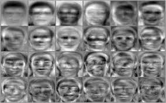
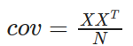
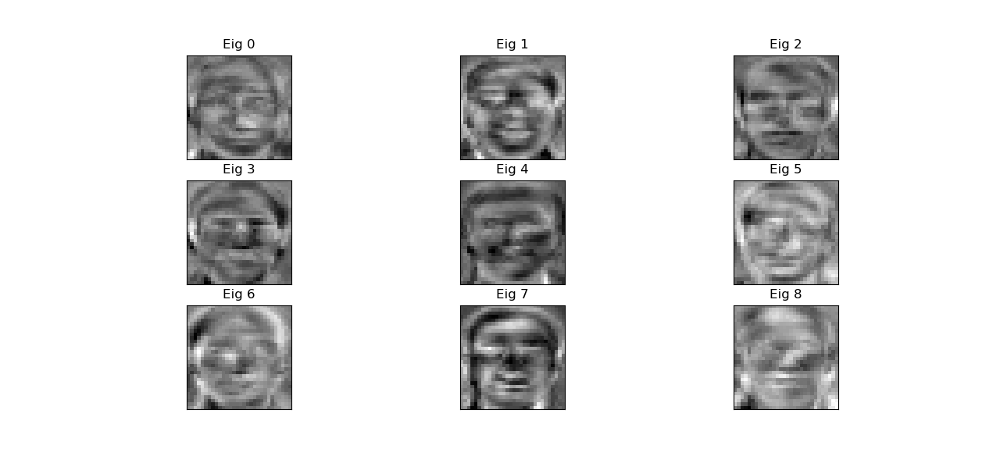
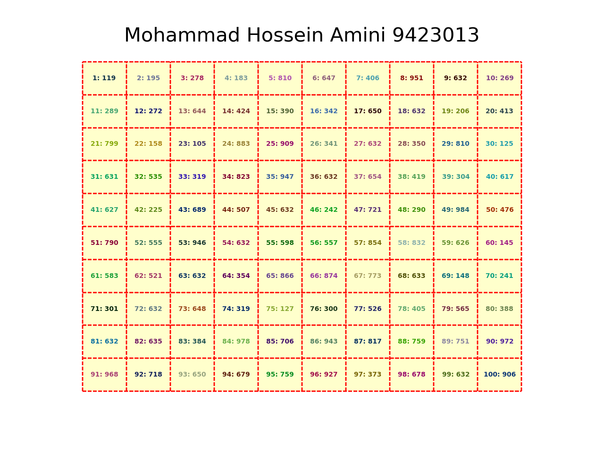

<center>
<h1>
In The Name Of ALLAH
</h1>
<h2>
Advanced Programming - Homework 7
</h2>
<h2>
Dr.Amir Jahanshahi
</h2>
<h3>
Deadline: Sunday, 18 Khordad - 23:00
</center>

Recommended Modules: **os**, **matplotlib**, **numpy**, **OpenCV**
# Face Recognition


## Introduction

For the faces, there are 2 ways of facing! Detection and Recognition.
In this homework, you're going to make a simple face recognition application using interesting mathematical tools! So let's start it...

We'll be using a method of recognition called <b>eigenfaces</b>. This method is just a straightforward application of the famous <i>Principal Component Analysis</i> (PCA) to a dataset of faces. There will be some discussions about PCA and more theory details in the last part of the TA classes for those who may love it!

But what are eigenfaces? Generally speaking, we can assume each image of face as a 30\*30 image. So we can flatten it to be a 900-element vector in the 900-dimensional space. We're looking for directions in which these vectors of faces (when projected on those directions) vary most. Those directions will be the **eigenfaces**. The funny part is that eigenfaces turn out to look like blurry faces!  Below, you can see an example of some eigenfaces.



It actually turns out that eigenfaces are just the eigenvectors of the covariance matrix of faces vectors. In fact, by assuming that each image of face is a random vector, we can estimate their covariance matrix. Eigenfaces are the eigenvectors of this covariance matrix. The more the eigenvalue corresponding to an eigenvector, the more variance is there when projecting faces vectors over that eigenvector. As we all know, there are 900 eigenvectors and eigenvalues for a 900*900 covariance matrix. But just keeping a very little amount of those 900 would suffice to distinguish and recognize different faces. So we'll be just keeping about 25 eigenfaces with the most corresponding eigenvalues and projecting each face through those directions. Doing this, we have a vector of about 25 elements instead of 900 for each face! That's amazing! Just as your homework is ;-)

After generating 25-element vectors from each 900-pixel face as told, it's time for the recognition task. We'll be using a very simple classification algorithm called **k-Nearest Neighbours**. In this algorithm we'll calculate Euclidean distance from  the 25-element of a newly arrived face to all 25-element vectors of faces of people we have in our dataset. We'll be keeping the *k* lowest distances. The newly arrived face belongs to the person who has repeated most in these k lowest distances.

After gaining some intuition about it, let's begin coding...

First of all, implement **loadImage** function which gets an image address and returns. You can use *imread* and *resize* functions in OpenCV. This function must return the flattened 900\*1 numpy array of the image and the 30\*30 numpy array of the image.

```python
face_vec, face = loadImage('3.pgm')
```

Now you need to read each of the faces in the given dataset and resize them to be 30\*30. You must implement **loadFaces** function such that it gets the folder of the dataset and return a numpy array such that each of it's columns are one of the images flattened in a 900-element vector. Don't forget to normalize each image so that it's largest element be 1. 

```python
X = loadFaces('att_faces')
```

Time for estimating the covariance matrix. It can be estimated as the following...



Where *N* is the number of faces (columns of X).

After estimating the covariance matrix, you can easily find the eigenfaces by finding eigenvectors of the covariance matrix. Now implement <b>findEigenFaces</b>
function so that it gets the covariance matrix and returns the eigenfaces and their corresponding eigenvalues. It must return them in a sorted manner, i.e, 
eigenfaces must be sorted by their corresponding eigenvaluse. So the first column of the eigenfaces matrix should be the one with the largest corresponding eigenvalue. Your function must work like the following.

```python
efaces, evals = findEigenFaces(cov, 25) # Returns top 25 eigenfaces i.e. those with largest eigenvalues
```

Note that when no second argument is provided, your function must return all the eigenfaces in the sorted order mentioned earlier.

Now implement the **showEigenFaces** function. It must get a list of indexes and show the eigenfaces with those indexes in a beautiful manner. It also must save the figure with the name of **FaceRecognition.png**. Your function should work and result like this...

```python
showEigenFaces(efaces, [3, 3])
```



Now time to turn each 900-element vector of faces into a 25-element vector. For this, you must project each 900-element vector of a face into each one of the top 25 eigenfaces from previous part. In otherwords you must do the inner product of the 900-element face vector into each of the top 25 eigenfaces to obtain 25 numbers and turn them into a 25-element vector. So implement <b>convertFace</b> function. If given a matrix of the whole dataset (like X), it must return the new converted matrix with each column being a 25-element vector instead of 900! Also, if given a single 900-element vector of a face, it must return a single 25-element vector of that face. It should work like this...

```python
newX = convertFace(X, eigenfaces)
```

Time for generating **createDataset** function. It gets the root folder name. Here we assume that, just like the given dataset in the homework, each idividual person has his or her own folder of images with the name of the folder as his or her name. So your function gets the root (main) folder and goes through each subfolder and for each image, it generates a 2-element tupple of the reduced vector of that image and the person's name. Finally, it returns a list of these tupples.

```python
dataset = createDataset('att_faces')
```

If you've reached here, congratulations! Now it only suffices to do the recognition (classification) task. So implement the <b>kNN</b> function such that it gets the number *k*, the dataset, it's corresponding names and a new face and find out whose face it belongs to. As already explained, your function must find the Euclidean distances between the input face and each of the faces in the datasets and find out which person is repeated the most between the k least distances. So the input face belongs to that. <b>kNN</b> must return all k nearest neighbours of the input face with their corresponding distances and the person that is most repeated between them. Here's how your function must work...

```python
nearest_neighbours, name = kNN(dataset, input_face_vec, eigenfaces, 5)
```

Now you can have a juice for yourself! You've implemented a face recognition app!

# Math Game

Choose a number between 1 and 99. Now subtract the sum of your numbers digits from the original number and call it **result**. look at the **result**'s position in the below image. We think the corresponding code is **1**. How do you think we got that?!



In this homework you would code this game. 

# generateArray Function
Implement the **generateArray** function it should produce a 10\*10 numpy array in which each element is a random number between 100 and 999. The i-th elements of this array (i has a factor of 9) must be all the same. So for example ```arr[0,8]=arr[1,7]``` and so on.

# play Function
Now implement the **play** function. It should generate a figure just like the above picture and save it with the name of **table.png**. Your function should have a **silent** argument which is False by default. If it is False, when we call the play function, the figure must pop up. Else no figure should be displayed and it should just be saved in the folder of your script.

Your generated figure must have the following properties.


*   Each element of the table must have a random number.
*   Your name and student number must be printed in a large size at the top of the figure.
*   Inside the figure must have a different background color.

```python
play(silent=False)
```

 
